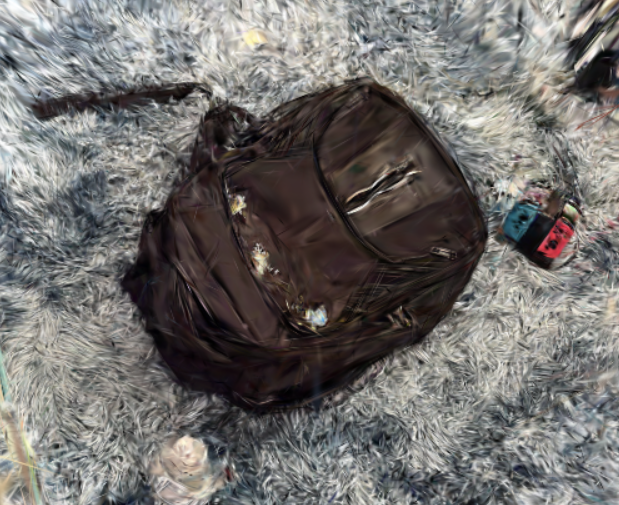

## Get Started

### Installation
1. Clone the DenseColmap repository and download pre-trained model.
```bash
git clone --recursive https://github.com/RonnieyL/DenseColmap.git
cd densecolmap
mkdir -p mast3r/checkpoints/
wget https://download.europe.naverlabs.com/ComputerVision/MASt3R/MASt3R_ViTLarge_BaseDecoder_512_catmlpdpt_metric.pth -P mast3r/checkpoints/
```

You may have to download NVIDIA CUB based on the version of Nvidia toolkit that you are running. ( <12.0 requires NVIDIA CUB to be installed)

2. Create the environment, here we show an example using conda.
```bash
conda create -n densecolmap python=3.10.13 cmake=3.14.0 -y
conda activate densecolmap
conda install pytorch torchvision pytorch-cuda=12.1 -c pytorch -c nvidia  # use the correct version of cuda for your system
pip install -r requirements.txt
```

1. Optional but highly suggested, compile the cuda kernels for RoPE (as in CroCo v2).
```bash
# DUST3R relies on RoPE positional embeddings for which you can compile some cuda kernels for faster runtime.
cd croco/models/curope/
python setup.py build_ext --inplace
```

## Changes from InstantSplat
Modified `sfm_utils.py` and `init_geo.py` to remove train-test split functionality and video interpolation, focusing solely on dense reconstruction from MASt3R/DUSt3R outputs to COLMAP format.

## Converting Output
### Using convert.py
This script converts the initial reconstruction into a COLMAP-compatible format:
```bash
python convert.py --source_dir path/to/images --model_dir path/to/output
```
- Input: Takes the sparse reconstruction from `init_geo.py`
- Output: Creates a `sparse` folder with COLMAP-formatted files (cameras.txt, images.txt, points3D.txt)

### Using alt_convert.py
Alternative conversion method that preserves more points and includes confidence scores:
```bash
python alt_convert.py --source_dir path/to/images --model_dir path/to/output --conf_threshold 0.5
```
- Input: Same as convert.py
- Output: Creates similar COLMAP format but:
  - Retains more 3D points by using different filtering criteria
  - Includes point confidence scores in points3D.txt
  - Generally produces denser reconstructions

The confidence threshold parameter (--conf_threshold) can be adjusted to control point density vs. quality trade-off.

### `visualize.py` - Quick COLMAP Scene Viewer

For fast visualization of COLMAP bins without starting a Viser server:
```powershell
python visualize.py path/to/sparse/0
```

## Intended Use

The goal is that one can directly use the outputs of convert.py in a gaussian splatting pipeline such as Gsplat (from UC Berkeley) or the original Gaussian Splatting pipeline (from the Kerbl paper)



## Acknowledgement

This work is built on many amazing research works and open-source projects, thanks a lot to all the authors for sharing!

- [InstantSplat](https://github.com/NVlabs/InstantSplat) 
- [Gaussian-Splatting](https://github.com/graphdeco-inria/gaussian-splatting) and [diff-gaussian-rasterization](https://github.com/graphdeco-inria/diff-gaussian-rasterization)
- [DUSt3R](https://github.com/naver/dust3r)

## Citation
If you find our work useful in your research, please consider giving a star :star: and citing the following paper :pencil:.

```bibTeX
@misc{fan2024instantsplat,
        title={InstantSplat: Sparse-view Gaussian Splatting in Seconds},
        author={Zhiwen Fan and Kairun Wen and Wenyan Cong and Kevin Wang and Jian Zhang and Xinghao Ding and Danfei Xu and Boris Ivanovic and Marco Pavone and Georgios Pavlakos and Zhangyang Wang and Yue Wang},
        year={2024},
        eprint={2403.20309},
        archivePrefix={arXiv},
        primaryClass={cs.CV}
      }
```